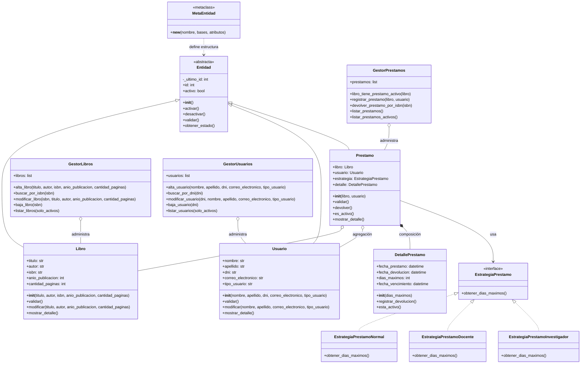

# Diagrama UML - Sistema de Gestión de Biblioteca Digital

Este diagrama representa las clases principales del sistema, sus atributos, métodos principales y relaciones.

## Explicación de las relaciones

### Herencia

`Libro`, `Usuario` y `Prestamo` heredan de `Entidad`.

Esto permite reutilizar atributos y métodos comunes, como `id`, `activo`, `activar()`, `desactivar()` y `obtener_estado()`.

### Agregación

`Prestamo` se relaciona con `Libro` y `Usuario`.

Se considera agregación porque el libro y el usuario existen independientemente del préstamo. Es decir, si se elimina un préstamo, el libro y el usuario siguen existiendo en el sistema.

### Composición

`Prestamo` contiene un `DetallePrestamo`.

Se considera composición porque el detalle de fechas existe como parte del préstamo. Si el préstamo no existe, el detalle del préstamo tampoco tiene sentido por sí solo.

### Patrón de diseño Strategy

El sistema utiliza el patrón Strategy mediante la clase `EstrategiaPrestamo` y sus implementaciones:

- `EstrategiaPrestamoNormal`
- `EstrategiaPrestamoDocente`
- `EstrategiaPrestamoInvestigador`

Este patrón permite calcular la duración máxima del préstamo según el tipo de usuario sin modificar la clase `Prestamo`.

### Metaclase

`MetaEntidad` se utiliza para controlar que las clases principales del dominio que heredan de `Entidad` tengan un método `validar()`.

### Decorador

El decorador `registrar_accion` se utiliza en métodos como `activar()` y `desactivar()` para registrar acciones realizadas sobre las entidades.
